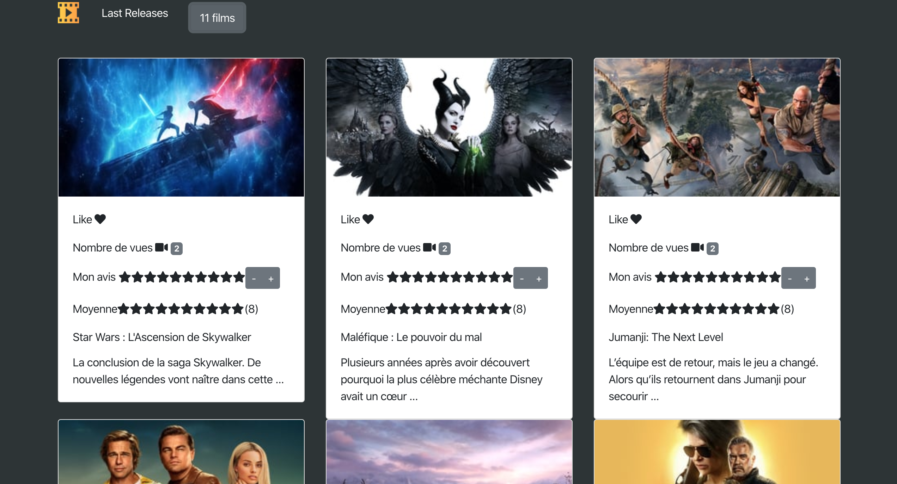
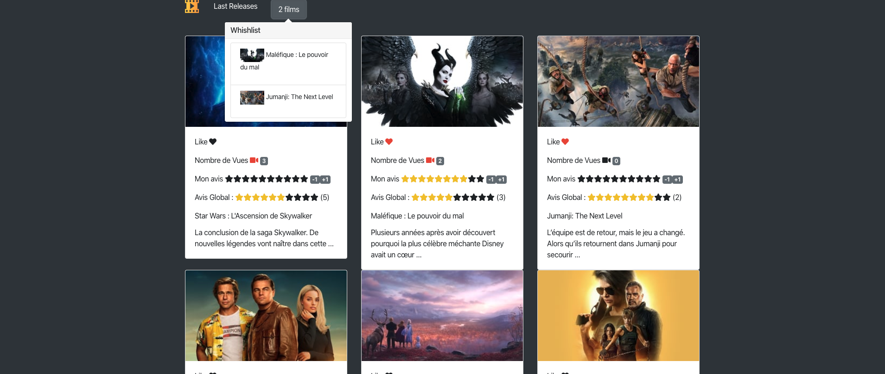

<h1 align="center">React Movie</h1>

<h2 align="center">
  
</h2>

<h2 align="center">
  
</h2>

## React Movies

React Movies est un site qui permet d’afficher les films les plus populaires avec la possibilité de créer une whishlist, placer un compteur de vues et de donner une évaluation de chacun des films présentés.

## Les fonctionnalités développées

- Proposer un catalogue de films actuellement au cinéma
- Mettre en place un descriptif de chaque film (photo, titre et description)
- Liker un film
- Proposer une page wishlist
- Mettre en place un compteur global du nombre de films contenus dans la wishlist

## Mes skills tech à l’issue de ce projet :

> Créer une interface graphique avec JSX

> Utiliser la librairie React Stap

> Découper une application en composants React

> Mettre en oeuvre des modules en ES6

> Maîtriser les concepts de propriété et d’état d’un composant React

> Maîtriser la gestion des événements en React

> Faire remonter de l’information entre les composants React (Reverse Data Flow)

> Mettre en place votre propre API via un Backend

> Maîtriser le cycle de vie d’un composant React

> Faire communiquer React avec un Backend grâce à Ajax

## Built With

- [React](https://reactjs.org/)
- [The Movie Database API](https://api.themoviedb.org)

## Installation

```
$ git clone git@github.com:saidaZgl/React-Movies.git
$ cd react-movie
$ npm install
$ npm start
```

Go to `http://localhost:3000`.
